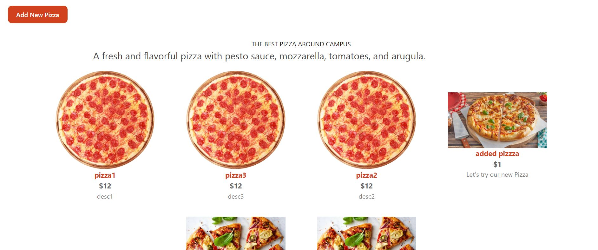
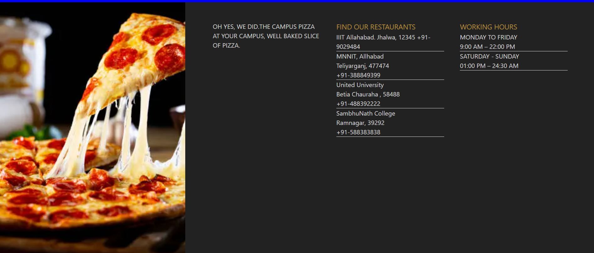
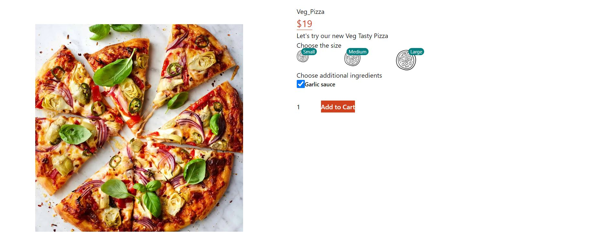
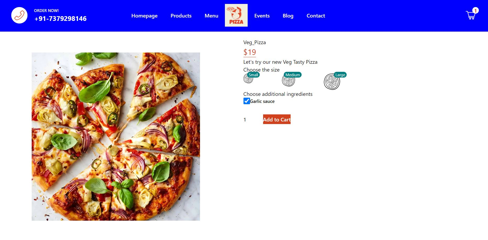
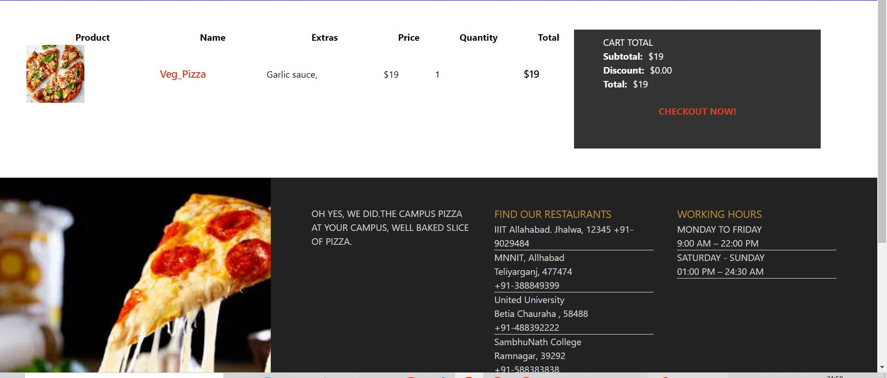
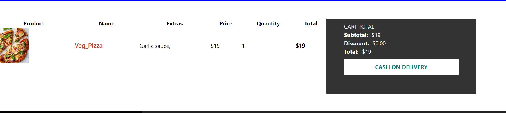
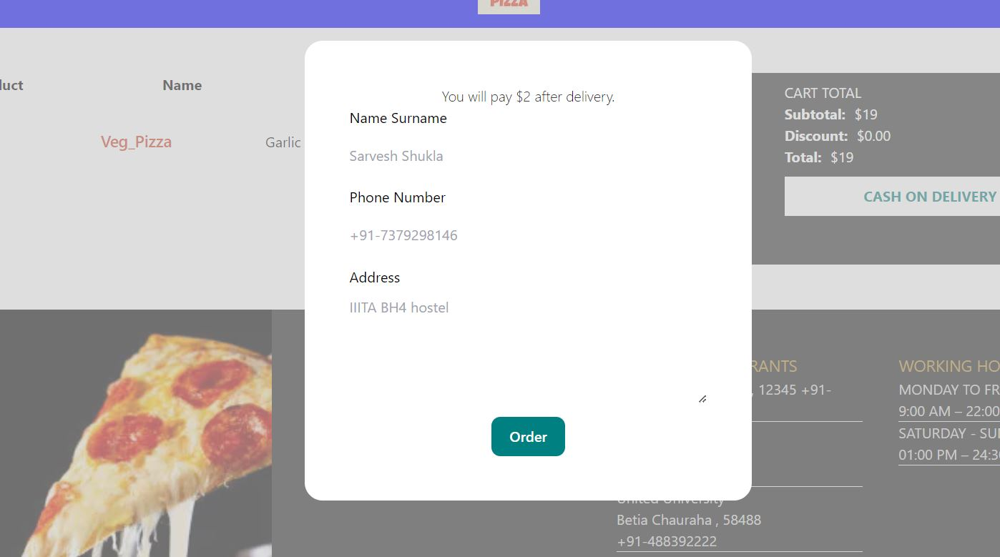
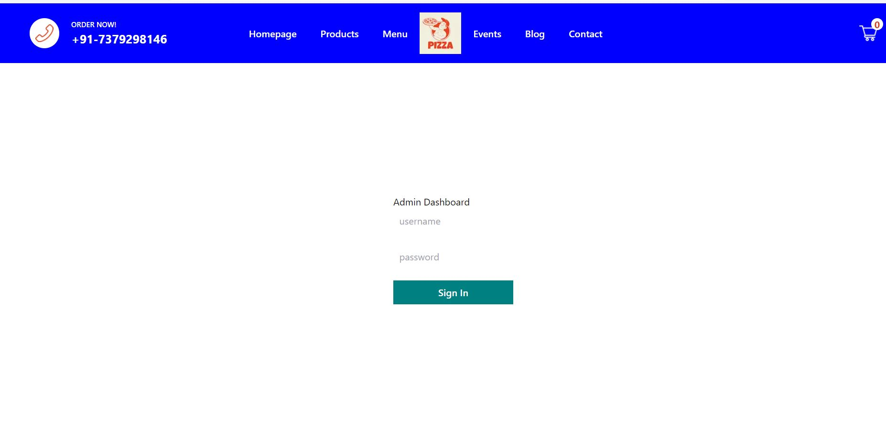
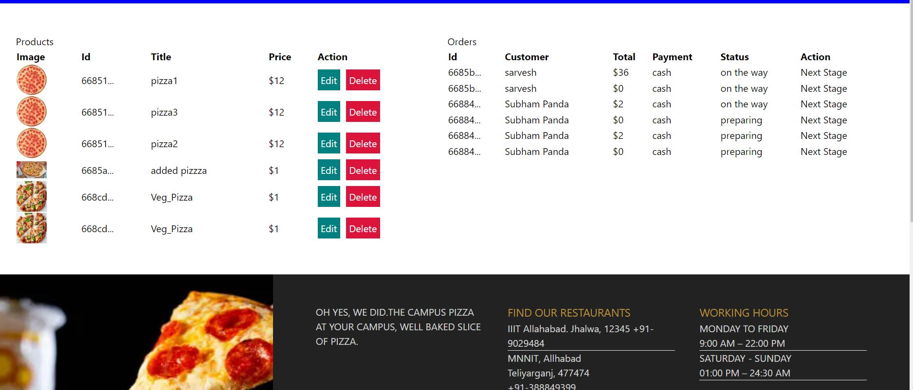

# Campus Pizza Project

Campus Pizza Project is a web-based application designed to streamline the process of ordering pizzas for students and faculty on campus. It offers a user-friendly interface for placing orders, tracking deliveries, and managing menu items efficiently.

## Features
- **Pizza Ordering**: Easily select and customize pizzas from a menu.
- **Order Tracking**: Track the status of pizza orders in real-time.
- **Adding New Pizza**: We can add new pizza, and we can set the price too.
- **User Authentication**: Secure login and registration for students and staff.
- **Admin Dashboard**: Manage menu items, orders, and delivery status.
- **Responsive Design**: Ensures seamless user experience across devices.

## Screenshots


*Homepage: First pop up of our web based application ...Showing Navbar and Homepage .*


*section where we can add new pizza and the pizza which are shown can be ordered by user.*


*Added Pizza which were added by me during testing.*


*Footer of our application where the address of our restaurants are shown with timing.*


*After Clicking on the Pizza, user would choose of which size pizza he/she wants.*


*We can choose additional ingredients on the basis of that price would increase.*


*As the User click on Add to Cart the cart count will increase immediatly.*


*Here We can see the name of our pizza, price , quantity etc.*


*Payment Page: we can choose here our method of payment.*
*Note : Online payment option hasnot been added yet.*


*By filling out this form , user can order the pizza.*


*Admin Login page - where Admin can login by using correct credentials.*


*After Admin Login , he/she can see all the Ordered pizza and can chage the status, edit or delete pizza.*

## Getting Started

### Installation

1. **Clone the Repository**:
   ```bash
   git clone https://github.com/your-username/campus-pizza-project.git
   cd campus-pizza-project
   
2. **Install Dependencies**:
   npm install

3. **Run the developement server**:
   npm run dev
   or yarn dev

4. **Open your Browser**:
Open http://localhost:3000 to see the result.


## Tech Stack
- MongoDB for database management
- Next.js for server-side rendering and routing
- React for building dynamic user interfaces
- JavaScript for frontend and backend logic
- PostCSS for styling
